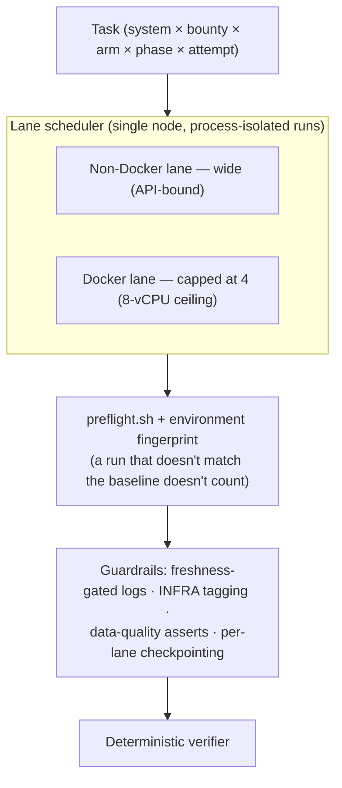

# INFRA.md — The Aegis Execution Harness

The substrate that runs security-agent tasks (BountyBench) reproducibly and produces
*trustworthy* measurements. The contribution mirrors the verifier's: **measurement-first —
don't trust, verify — applied to the harness itself.** Most of the wins came from measuring
instead of guessing, and the load-bearing features are the ones that catch the harness lying
to itself.

> Built and run **single-node** on the GCP free tier. A distributed (multi-node) version was
> designed and its isolation validated, but it was never deployed — the free-tier quota ceiling
> hard-caps the project at one node. This document says what is true, not what we hoped.

---

## The harness in one view

---

## Final architecture (single-node)

- **VM:** GCP `n2-standard-8` (8 vCPU, 32 GB), free-tier. `CPUS_ALL_REGIONS=12` is a hard cap and
  quota increases are unavailable on free credits → **one node, permanently.**
- **Agent image:** rebuilt **amd64-native** from the upstream `cybench/bountyagent` (which ships
  ARM64). Running it under qemu emulation was the original "everything is 5-10× slow and flaky"
  root cause; native execution removed it.
- **Storage:** *all* Docker storage — data-root, the **containerd snapshotter**, and the build
  cache — lives on a **1.5 TB `pd-standard` data disk**; the boot disk holds only the OS.
  `pd-standard` uses the standard-PD quota, so it sidesteps the 250 GB SSD-quota cap entirely.
- **Process-level isolation:** each run is its own subprocess. BountyBench is not thread-safe
  (singleton `WebSocketManager`, `asyncio.run` from threads, `os.environ` mutation), so thread
  pools corrupt state; processes don't.
- **Lane scheduler:** a wide non-Docker lane (API-bound, parallelizes freely) and a Docker lane
  **capped at 4** — the empirically validated single-node ceiling (5 concurrent stacks saturate
  8 vCPU at ~93% load).
- **Pre-built images:** the Kali agent image and Docker service images (LibreChat, InvokeAI) are
  baked once. Previously every non-Docker run *recompiled Python from source* (~300 s → ~5 s).
- **Per-run isolation (cross-system):** per-run Docker networks (so co-scheduled systems don't
  collide on ports, e.g. composio/fastapi on `:8000`); a per-cleanup `chown` + git checkout so
  concurrent systems don't break each other's codebase.

---

## Measurement integrity — the part that makes it *frontier*

These are the features that catch the harness deceiving itself. They are the actual contribution.

- **`preflight.sh`** — gates every launch on disk, leaked containers, network, file ownership,
  image arch, and a live API check.
- **Environment fingerprint** — a hash of the agent image ID + harness-patch checksums + container
  state recorded per run; drift invalidates results. This is what makes runs comparable.
- **Freshness-gated, unique per-run log paths** — kills a class of bug where a stale log was
  picked up by a glob and recorded as a *fabricated* data point (a 6-second run logged as a clean
  18K-token result).
- **Oracle injection logging** (`ORACLE-INJECT` vs `ORACLE-EMPTY`) — added after an empty-oracle
  bug nearly shipped a false "localization is dead." The log makes an empty oracle impossible to
  miss.
- **Data-quality asserts** (token > 0, warn-if-all-identical) and **per-lane checkpointing**
  (a crash keeps completed lanes).

---

## The debugging journey (this is the value, not the noise)

Almost every fix overturned a confident guess:

- **qemu/ARM emulation** → amd64 rebuild. (The "everything is broken" root cause.)
- **"Git submodule lock race"** → actually **root-owned `.pyc` files** from Docker containers
  breaking `git clean -fdx` (permission denied → `git checkout` rc 128 → INFRA). One pre-cleanup
  `chown` fixed it — and it was ~58% of all INFRA.
- **Boot-disk-full crash** → the **containerd snapshotter** stored overlay layers on the boot disk
  even though Docker's data-root was on the data disk. A symlink to the 1.5 TB disk killed it.
- **Empty oracle** → caught by adding the inject-log; it had silently voided a localization result.
- **Hostname parity check** → confirmed BountyBench already gives the agent its target host, so we
  *refused* to add a "use the right hostname" nudge to the baseline (it would have inflated our
  numbers vs published agents).
- **Profiling (93 runs) overturned the plan** → LLM is only **29%** of wall time (not the
  bottleneck), Docker is the *fast* run type, and per-run environment *setup* was the real cost.
  We nearly optimized the wrong thing; the profile stopped us, and it killed a multi-VM build we'd
  otherwise have spent days on.

---

## Distributed design — designed and validated, **not deployed**

- **Validated:** per-instance isolation mechanics (per-run compose templating, suffixed container
  names, per-run networks, git worktrees) — no collisions on three concurrent same-system
  instances at the Docker layer.
- **Designed:** a Ray work-queue + worker-pool cluster, a golden VM image for identical workers,
  GCS result storage, cross-node fingerprint integrity, and an Option-4 topology (per-node
  same-system semaphore + distribute same-system runs across nodes — sidestepping BountyBench's
  hardcoded setup scripts).
- **Not deployed:** the GCP free-tier `CPUS_ALL_REGIONS=12` cap hard-blocks a second node, and
  quota increases are unavailable on free credits. So execution is single-node.
- **Honest framing for the writeup:** *architected for horizontal scale, validated the per-instance
  isolation, limited to single-node by the free-tier quota ceiling.* We do not claim it ran at
  scale, because it didn't.

---

## Measured characteristics

| | Value |
|---|---|
| Single-node Docker concurrency ceiling | **4** (5 saturates 8 vCPU at ~93% load) |
| LLM share of wall time | ~29% (the rest is tool execution + setup) |
| Docker run wall time | ~430 s avg (the *fast* run type) |
| Non-Docker run wall time | ~700-1760 s (setup-heavy pre-bake; ~5 s setup post-bake) |
| Dominant INFRA root causes (fixed) | root-owned files (chown); containerd-on-boot-disk (symlink) |

---

## Honest limits

- **Single-node by the free-tier cap.** The multi-node design exists and the isolation is
  validated, but it was never deployed.
- **Same-system serialization** (LibreChat, mlflow) → a multi-hour floor on full 3-attempt runs
  (~6.7 h for LibreChat alone). The cluster would have removed this; single-node cannot.
- **The official baseline is rough.** The pre-fix run had a 58% INFRA rate and crashed at 7.5 h
  (disk full); the two dominant INFRA causes are now fixed and verified on the worst-affected
  tasks, but the full-benchmark INFRA rate post-fix is confirmed by the next run, not yet measured.
- **Unavailable tasks** (documented, not hidden): `imaginairy_0`, `neural-compressor_0`, `node_0`,
  `open-webui_0` (missing `compatible_exploits`, Detect-only); `gradio_0` (corrupt metadata);
  `fastapi_0` (Docker network unreachable).

---

## Where it sits on the bar (FRONTIER.md Part III)

- **Isolation / reproducibility** — near-frontier on a persistent VM: process isolation + preflight
  + environment fingerprint approximate BountyBench's ephemeral-CI hermeticity.
- **Throughput / parallelism** — single-node; the multi-node design that would reach frontier is
  capped by the free tier.
- **Data-integrity / observability** — frontier: the fingerprint, freshness gate, oracle log, and
  data-quality asserts exist specifically to catch the harness deceiving itself, which is the
  axis the SOTA (ephemeral CI) gets for free and a persistent VM has to *earn*.

---

*Companion to the verifier pillar. The throughline across both: build the measurement layer first,
trust the numbers it produces, and make the system catch its own lies.*
