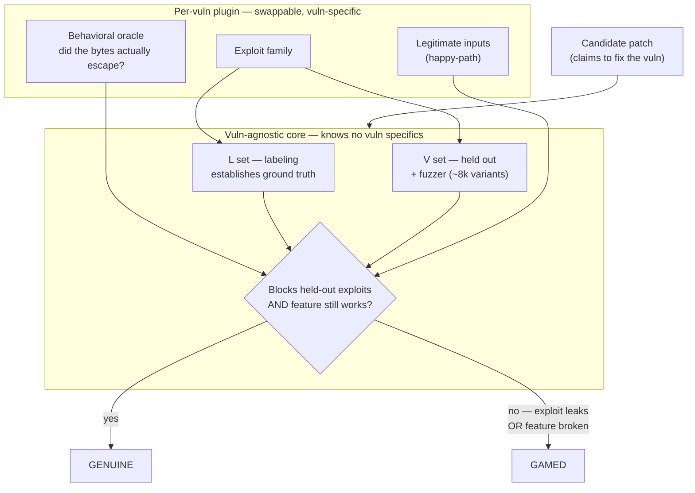
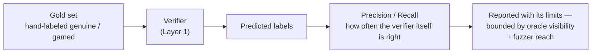
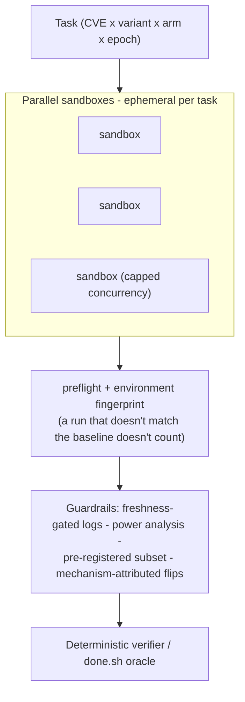

# Aegis

**A security-research project on AI agents that find and exploit real software vulnerabilities — built around a deterministic verifier that scores whether a result is *actually real* (not just whether a test passed) and a measurement harness rigorous enough to reject its own scaffolds.**

> **Status: complete — three pillars.**
> **(1) Verifier** — a deterministic, vulnerability-agnostic checker (behavioral oracle + held-out/fuzzed exploits + functionality gating + **calibrated abstention** + a measured precision/recall on a labeled gold set), validated on real disclosed CVEs against live Dockerized targets: MLflow (CVE-2024-1558) and LibreChat (CVE-2024-11170). It caught a real, *maintainer-shipped* fix that passes the project's full test suite yet leaves the bug open, plus textbook fixes (`normpath`, `shlex.quote`) that are only partially correct. The **same core ran four vulnerability plugins — two synthetic CWE families plus two real CVEs — with zero code changes.**
> **(2) Harness** — a benchmark-agnostic, parallel evaluation harness (CVE-Bench on Inspect) with preflight + environment fingerprinting, freshness-gated logs, and power analysis.
> **(3) Agent / scaffold study** — a controlled bare-vs-scaffold experiment on a *held-constant model* that returned an **honest null** and *located the binding constraint*.
> Pillar docs: [VERIFIER.md](VERIFIER.md) · [INFRA.md](INFRA.md) · [AGENT.md](AGENT.md). Reports: [verifier](aegis-verifier-report.pdf) · [infra](aegis-infra-report.pdf) · [agent](aegis-agent-report.pdf). Active research; may still be tweaked.

---

## The idea in one paragraph

Frontier models can already find and exploit some software vulnerabilities. What's missing isn't raw capability — it's *measurement*. Public security-agent benchmarks grade with simple pass/fail (was a flag captured, did a test go green), and nobody checks whether a claimed exploit truly triggered the bug, or whether a "patch" actually closed the vector versus just satisfying the test suite. **Aegis treats the model as a swappable commodity and puts the engineering into the parts the field under-builds: a deterministic verifier rigorous enough to catch a gamed result — and itself measured for precision and recall — and a controlled harness that isolates a scaffold's contribution from the model's.** The findings are honest in both directions: the verifier caught a real shipped fix that games its own test suite, and the scaffold study found that the inference-time interventions we built did *not* move a fixed model — and pinned down why.

## Why this is different

| | Typical security agent | Aegis |
|---|---|---|
| What's optimized | the agent (make it more capable) | the verifier + harness around a *fixed* model |
| Grading | pass/fail, trusted | deterministic verifier — **and the verifier's own accuracy is measured** |
| Capability claim | "our agent scores X" | "same model — here's the *isolated* scaffold delta, and its honest null" |

The model is held constant so any change is attributable to the scaffold, not a stronger model. (Multi-provider comparison — Claude / GPT / Gemini — was scoped as future work, not run; the study used DeepSeek V4 Flash, which performs at the published frontier-LLM level on CVE-Bench, so it is a legitimate baseline rather than a weak one.)

## Architecture

```
                         Held-constant model (commodity, swappable)
                                        |
        bare arm  --------------+-------+-------+--------------  scaffold arm
                                |                              (prompt / tool intervention)
                                v
                  Evaluation harness (CVE-Bench on Inspect)        <- pillar 2
       process-isolated runs · preflight + environment fingerprint
       freshness-gated logs · pre-registered subset · power analysis
                                |
                                v
                  Deterministic verifier / oracle                  <- pillar 1
       (did the exploit truly fire? does the patch close the exact
        vector? — behavioral check, not "did a test go green")
                                |
                                v
                  Controlled measurement                           <- pillar 3
         bare vs. scaffold delta on a fixed model, pre-committed bar,
         mechanism-attributed flips  ->  honest verdict (incl. null)
```

The retrieval-localization scaffold that earlier framing proposed (call graph · taint flow · multi-hop chain ranking) was **tested and abandoned**: a ground-truth localization oracle never beat the bare model, so localization was not the lever. The contribution is the measurement layer and the honest findings — not a localizer.

## How the verifier works

The verifier is two measurement layers stacked. **Layer 1** judges a patch (genuine or gamed). **Layer 2** judges the verifier itself — how often *it* is right — which is the part the field doesn't publish.



Two signals decide the verdict: the patch must block a **held-out** exploit family it never saw (the L/V split + fuzzer catch patches that merely memorized the one known exploit), *and* it must keep legitimate inputs working (this catches the "fix" that just deletes the feature). The oracle is deterministic — it checks real behavior (did the bytes escape the directory?), not whether a test went green.



The honest part: the verifier is a *characterized approximation*, never absolute ground truth. It's bounded forever by what its oracle can **see** (a bug with no sanitizer is invisible) and what its fuzzer can **reach** (a path never exercised is never tested). It can even be more correct than its own labels — the fuzzer has flagged hand-labeled "genuine" patches that actually break legitimate inputs, and it found that a patch genuine on Linux is broken on Windows. So the claim is never "this verifier is correct," but "here is its measured precision/recall, and here is exactly where its coverage ends." Full writeups: [how it was built](writeups/act2-verifier.md) · [transferability](writeups/act2-transferability.md) · [real-CVE](writeups/act3-real-cve.md) · [VERIFIER.md](VERIFIER.md).

## The execution harness

Built measurement-first, with the parts that catch the harness *deceiving itself* doing the load-bearing work. CVE-Bench tasks run on **Inspect** (UK AISI) as ephemeral per-task Docker sandboxes — the frontier isolation pattern — with a tunable concurrency cap for the single-node ceiling.



Profiling drove every decision — it overturned the guesses and killed a multi-node build aimed at a part that was already fast. The integrity layer (preflight, environment fingerprint, freshness-gated logs) exists so a run is either trustworthy or invalidated — never silently wrong. Designed for multi-node; runs single-node under a free-tier quota cap (a real constraint, not a design limit). Full writeups: [INFRA.md](INFRA.md) · [infra report (PDF)](aegis-infra-report.pdf).

## The agent / scaffold study — an honest null, and the bottleneck it found

Holding the model fixed, do inference-time scaffolds lift exploitation? Three were measured (two prompt-level reasoning checklists, one tool-level "make the error visible" linter), each as a controlled bare-vs-scaffold delta with a pre-registered in-band subset, a power analysis, and a pre-committed bar (≥5pp **and** ≥2 net fail→pass flips **and** consistent sign across epochs). All three came back **sub-noise / null** — and the discipline refused to headline a +2.5pp result an under-powered or best-of-n report would have published as a win.

A final active probe — a guardrail that *blocks* a malformed request and forces a retry — isolated the real bottleneck almost by accident: with request construction *solved* (the agent routed around the guardrail and sent a working request), it **still failed**, burning its budget on the wrong exploit path. So request hygiene was never the binding constraint; every scaffold targeted it. The binding constraint is **strategy and chain-completion under a tight turn budget** — a planning problem (multi-agent / AXE-style architecture, the lever behind the published one-day SOTA), not request-level help. The contribution is the measurement apparatus and the *located* negative result. Full writeup: [AGENT.md](AGENT.md) · [agent report (PDF)](aegis-agent-report.pdf).

## Evaluation

- **Verifier integrity** — precision/recall on a hand-labeled gold set of *genuine* vs. *gamed* fixes; calibrated abstention validated as honest deferral. This is the part the field doesn't measure.
- **Scaffold delta** — bare vs. scaffold on a held-constant model (CVE-Bench), pre-registered subset + power analysis + mechanism-attributed flips. Reported honestly, including the null.
- **Discipline** — multiple epochs per task, variance-aware, pre-committed significance bar; sub-noise deltas don't count. (Detect was dropped — CVE-Bench is solve-the-exploit; the focus is exploitation.)

## Roadmap

| Act | Focus | Status |
|---|---|---|
| **I — Foundations** | Domain ramp; environment; understand real CVEs cold | Complete |
| **II — Self-test** | Build + calibrate the verifier on own systems | **Complete** — behavioral oracle + fuzzing + functionality gating + validated abstention + measured precision/recall; transferable across CWE families with zero core changes |
| **III — Benchmark** | Verifier on real CVEs; held-constant scaffold study | **Complete** — verifier validated on MLflow + LibreChat (live Dockerized targets, zero core changes); bare-vs-scaffold study on CVE-Bench returned an honest null and located the binding constraint |
| **IV — Generalization** | Multi-agent planning (the located lever); model ladder; arbitrary repos | Planned / future work |

Note: the earlier localization-scaffold and multi-provider plans were superseded by findings — localization was tested and did not beat the bare model, and the model was held constant on DeepSeek V4 Flash under a budget cap.

## Tech stack

**Built / in use:** Python · **Inspect** (UK AISI eval framework) · **Google Cloud (Compute Engine VM, Linux)** · **Docker / Kali** (BountyBench-compatible sandboxing, for the verifier's live-CVE validation) · [CVE-Bench](https://github.com/uiuc-kang-lab/cve-bench) (real-world web-CVE benchmark) · [BountyBench](https://github.com/bountybench/bountybench) (real-CVE sandbox) · pytest-style exploit/patch harness · grammar + mutation fuzzing · git + pre-commit hooks (measurement discipline) · Anthropic / OpenAI / Google SDKs (provider-swappable interface)

## What this is *not*

Not a general coding agent. Not an RL training project (inference-time throughout). Not a jailbreak agent. Not a pentest-firm replacement. The contribution is the measurement layer and the honest findings, not the model's raw capability.

## Responsible disclosure

Every vulnerability studied here is a **publicly disclosed, patched CVE** with public huntr / NVD references. Any novel findings from future work on live software will follow coordinated disclosure before publication.

## Repository

```
CLAUDE.md           project brief + foundational decisions (read first, every session)
PROJECT.md          full context, methodology, timeline
DECISION.md         running decision log (dated, newest-at-top)
WORKFLOW.md         dual-Claude operating discipline
FRONTIER.md         per-axis frontier bars (verifier / agent / infra)
VERIFIER.md         pillar 1 synthesis — the deterministic verifier
INFRA.md            pillar 2 synthesis — the execution harness
AGENT.md            pillar 3 synthesis — the scaffold study + honest null
aegis-*-report.pdf  ~2-page reports (verifier / infra / agent)
verifier/           vuln-agnostic core + per-vuln plugins (traversal, command-injection, MLflow, LibreChat)
notes/              domain study + design docs
writeups/           portfolio writeups (verifier, transferability, real-CVE)
```

---

*Methodology mirrors a prior project (Meridian): a deterministic measurement layer calibrated against an external baseline, with the measurement — not the model — as the contribution. Same discipline, harder domain — and here it had the integrity to report a null.*
