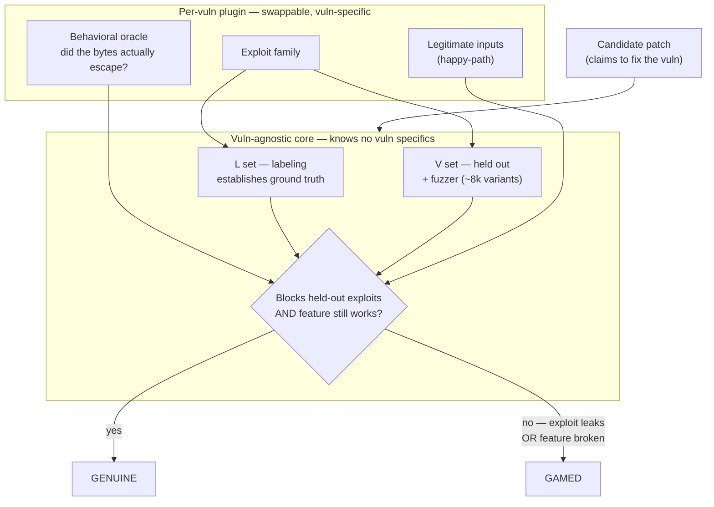
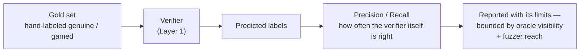

# Aegis

**A security research agent that finds and exploits real software vulnerabilities — paired with a deterministic verifier that scores whether the result is *actually real*, not just whether a test passed.**

> **Status:** Act III (bridge). A deterministic, vulnerability-agnostic verifier that scores whether a security patch *genuinely* closes a vulnerability — behavioral oracle + held-out/fuzzed exploits + functionality gating + **calibrated abstention** (returns "un-gradeable" rather than a false verdict) + a measured precision/recall on a labeled gold set. **Validated on real disclosed CVEs against live Dockerized targets** — MLflow (CVE-2024-1558) and LibreChat (CVE-2024-11170), running on a **Google Cloud VM** with a **Docker / Kali (BountyBench) sandbox**. It caught a real, *maintainer-shipped* fix that passes the project's full test suite yet leaves the bug open, plus textbook fixes (`normpath`, `shlex.quote`) that are only partially correct. The **same core runs four vulnerability plugins — two synthetic CWE families plus two real CVEs — with zero code changes.** Writeups: [real-CVE](writeups/act3-real-cve.md) · [transferability](writeups/act2-transferability.md) · [how it was built](writeups/act2-verifier.md) · bar: [FRONTIER.md](FRONTIER.md). Next: the agent + published-baseline comparison. Active research project.

---

## The idea in one paragraph

Frontier models can already find and exploit some software vulnerabilities. What's missing isn't raw capability — it's *measurement*. Public security-agent benchmarks grade with simple pass/fail (was a flag captured, did a test go green), and nobody checks whether a claimed exploit truly triggered the bug, or whether a "patch" actually closed the vector versus just satisfying the test suite. **Aegis treats the model as a swappable commodity and puts the engineering into the two things the field under-builds: a code-graph-aware retrieval scaffold that localizes vulnerabilities, and a deterministic verifier rigorous enough to catch a gamed result — and that is itself measured for precision and recall.**

## Why this is different

| | Typical security agent | Aegis |
|---|---|---|
| What's optimized | the agent (make it more capable) | the scaffold + verifier around a *fixed* model |
| Grading | pass/fail, trusted | deterministic verifier — **and the verifier's own accuracy is measured** |
| Capability claim | "our agent scores X" | "same model, better localization — here's the *isolated* delta" |

The model is held constant and swapped across providers (Claude / GPT / Gemini), so any improvement is attributable to the scaffold, not to a stronger model. Results are calibrated against published **BountyBench** baselines.

## Architecture

```
Vulnerable repo
      |
      v
Retrieval scaffold          <- the contribution
(call graph · taint flow · entry-point detection · multi-hop chain ranking)
      |
      v
Ranked suspicious paths
      |
      v
Model API (commodity, swappable)
(reasons over the paths -> exploit or patch)
      |
      v
Deterministic verifier      <- the contribution
(did the exploit truly fire? does the patch close the exact vector?)
      |
      v
Two-track evaluation
  |-- Capability:        Detect / Exploit / Patch  vs. BountyBench baselines
  |-- Verifier integrity: precision/recall on a labeled gold set
```

## How the verifier works

The verifier is two measurement layers stacked. **Layer 1** judges a patch (genuine or gamed). **Layer 2** judges the verifier itself — how often *it* is right — which is the part the field doesn't publish.



Two signals decide the verdict: the patch must block a **held-out** exploit family it never saw (the L/V split + fuzzer catch patches that merely memorized the one known exploit), *and* it must keep legitimate inputs working (this catches the "fix" that just deletes the feature). The oracle is deterministic — it checks real behavior (did the bytes escape the directory?), not whether a test went green.



The honest part: the verifier is a *characterized approximation*, never absolute ground truth. It's bounded forever by what its oracle can **see** (a bug with no sanitizer is invisible) and what its fuzzer can **reach** (a path never exercised is never tested). It can even be more correct than its own labels — the fuzzer has flagged hand-labeled "genuine" patches that actually break legitimate inputs. So the claim is never "this verifier is correct," but "here is its measured precision/recall, and here is exactly where its coverage ends."

## Evaluation

- **Capability** — Detect / Exploit / Patch on BountyBench (25 real systems, 40 bounties), reported against the published agent baselines.
- **Verifier integrity** — precision/recall on a hand-labeled gold set of *genuine* vs. *gamed* fixes. This is the part the field doesn't measure.
- **Discipline** — multiple attempts per task, variance-aware; sub-noise deltas don't count.

## Roadmap

| Act | Focus | Status |
|---|---|---|
| **I — Foundations** | Domain ramp; environment; understand 3 real CVEs cold | Complete — environment proven end-to-end on GCP; CVE study complete |
| **II — Self-test** | Attack own systems; build + calibrate the verifier | **Complete** — verifier built & calibrated (behavioral oracle + fuzzing + functionality gating + validated abstention + measured precision/recall); transferable across CWE families with zero core changes |
| **III — Benchmark** | BountyBench + ZeroDayBench vs. published baselines | **In progress** — verifier validated on real CVEs (MLflow, LibreChat) on live Dockerized targets, zero core changes; agent + baseline comparison next |
| **IV — Generalization** | Arbitrary open-source repos; optional RL loop | Planned |

## Tech stack

**Built / in use:** Python · **Google Cloud (Compute Engine VM, Linux)** · **Docker / Kali** (BountyBench-compatible sandboxing) · [BountyBench](https://github.com/bountybench/bountybench) (real-CVE benchmark) · pytest-style exploit/patch harness · grammar + mutation fuzzing · git + pre-commit hooks (measurement discipline) · Anthropic / OpenAI / Google SDKs (provider-swappable)

**Planned (retrieval scaffold + agent, Acts III–IV):** Tree-sitter (AST parsing) · NetworkX (call graphs) · CodeQL / Semgrep (static signal)

## What this is *not*

Not a general coding agent. Not an RL training project (inference-time throughout the core work). Not a jailbreak agent. Not a pentest-firm replacement. The contribution is the measurement layer, not the model's raw capability.

## Responsible disclosure

Every vulnerability studied here is a **publicly disclosed, patched CVE** with public huntr / NVD references. Any novel findings from future work on live software will follow coordinated disclosure before publication.

## Repository

```
CLAUDE.md           project brief + foundational decisions
AEGIS_CONTEXT.md    full context, methodology, timeline
DECISION.md         running decision log (dated)
WORKFLOW.md         dual-Claude operating discipline
FRONTIER.md         the verifier's frontier bar (tiers + dated anchors)
verifier/           vuln-agnostic core + per-vuln plugins (traversal, command-injection, MLflow, LibreChat)
notes/              domain study + design docs (Act I CVEs, verifier design)
writeups/           portfolio writeups (verifier, transferability, real-CVE)
```

The verifier core and plugins live in `verifier/`; the retrieval scaffold and agent are added as Act III–IV progress.

---

*Methodology mirrors a prior project (Meridian): a deterministic retrieval-metric verifier calibrated against an external baseline, with the measurement layer — not the model — as the contribution. Same discipline, harder domain.*
